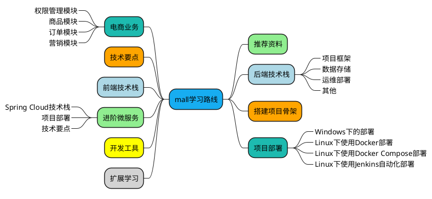

# 1.你好

|输入|输出|
|---|---|
|shuru|shuchu|

<http://www.7sbox.com>

# 2.大哥

[概要设计](概要设计.md#hello)

测试[^1]


*这里是一段斜体文本*
**这里是一段加粗文本**
***粗斜体文本1***
*这里是一段斜体中**包含粗体**的文字*
**这里是一段粗体中*包含斜体*的文字**
~~这是一段加了删除线的文本~~

# 3.Code

```c++
/* hello */
void test()
{
    printf("test");
}
```



# 4.什么啊

`http://www.sina.com.cn`

:joy:

[^1]: 什么什么东西
